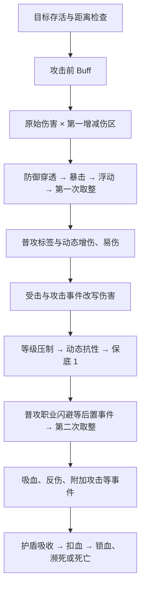

# 战斗机制与计算公式

本文按本地游戏源码的实际调用链整理，覆盖属性生成、普通攻击、技能、增减伤、防御穿透、暴击浮动、等级压制、元素抗性、Buff、护盾、回复及 PvP 差异。

核对日期：2026-09-16。源码是本地反编译 C#，不能据此保证与正在运营的客户端/服务端版本完全相同。本文区分三种结论：**源码确认**（能指出计算及调用位置）、**配置确认**（本地表的具体值）、**待验证**（赋值链异常、版本或运行环境未闭合）。下文没有标“待验证”的公式均指这份源码中的行为。

## 1. 来源、范围与阅读入口

源码根目录为项目同级的 `源码/源码/Assembly-CSharp/`，配置优先核对项目 `raw/` 与同级 `Config_decrypted/`。剧情表不参与此结算。

| 机制 | 主要证据与定位 |
| --- | --- |
| 通用伤害与事件顺序 | [CombatPanel.cs](../../../源码/源码/Assembly-CSharp/CombatPanel.cs)：`CalculateMaster`（5727）、`CalculateFinalDamage`（6041）、`CheckCirt`（6202） |
| 扣血、护盾、回复 | 同文件：`CalcuateDamageUpdateHpBar`（6296）、`RemoveShiledBuff`（6252）、`UnitTakeReply`（7326） |
| 完整英雄属性 | [HeroBattleAttributeGroup.cs](../../../源码/源码/Assembly-CSharp/HeroBattleAttributeGroup.cs)：属性 getter（373）、`GetBase*Add`（468）、成长（669） |
| 战斗属性及上限 | [UnitAttribute.cs](../../../源码/源码/Assembly-CSharp/UnitAttribute.cs)：属性 getter/setter（256）、英雄初始化（367）、PvP 初始化（462）、怪物（557）、宠物（683） |
| 防御常数及装载 | [monLevelStrength.json](../../../Config_decrypted/monLevelStrength.json)、[MonLevelStrengthData.cs](../../../源码/源码/Assembly-CSharp/MonLevelStrengthData.cs) |
| 等级压制表 | [general.json](../../raw/general.json)：`levelSuppressionCoefficientA/B`；[ClientConfig.cs](../../../源码/源码/Assembly-CSharp/ClientConfig.cs)：`InitLevelSupConf`（277） |
| 攻速与动画 | [UnitAI.cs](../../../源码/源码/Assembly-CSharp/UnitAI.cs)（713）、[Unit.cs](../../../源码/源码/Assembly-CSharp/Unit.cs)：`GetAtkAnimTimeScaleRate`（1016） |
| 冷却与技能消耗 | `CombatPanel.UpdateCdByCdDown/UpdateSkillCd`；[SkillBase.cs](../../../源码/源码/Assembly-CSharp/SkillBase.cs)：`SkillConsume`（361） |
| Buff 触发、叠层、持续时间 | [BuffBase.cs](../../../源码/源码/Assembly-CSharp/BuffBase.cs)：`SetbuffDectionType/CheckBuffAction`；[BuffControl.cs](../../../源码/源码/Assembly-CSharp/BuffControl.cs)：`Update/AddBuff` |
| 动态属性与独立增伤区 | [Buff_AttributeAdd.cs](../../../源码/源码/Assembly-CSharp/Buff_AttributeAdd.cs)、[BuffDamAddCommonType.cs](../../../源码/源码/Assembly-CSharp/BuffDamAddCommonType.cs) |
| 持续效果与建盾 | [Buff_Burning.cs](../../../源码/源码/Assembly-CSharp/Buff_Burning.cs)、[Buff_Poisoning.cs](../../../源码/源码/Assembly-CSharp/Buff_Poisoning.cs)、[Buff_Reply.cs](../../../源码/源码/Assembly-CSharp/Buff_Reply.cs)、[Buff_Shield.cs](../../../源码/源码/Assembly-CSharp/Buff_Shield.cs) |
| 伤害取消事件 | [HeroJob5Buff.cs](../../../源码/源码/Assembly-CSharp/HeroJob5Buff.cs)、[Buff_Hero041Star4.cs](../../../源码/源码/Assembly-CSharp/Buff_Hero041Star4.cs)；配置见 [buff.json](../../../Config_decrypted/buff.json) |
| 胜利恢复 | [BattleManager.cs](../../../源码/源码/Assembly-CSharp/BattleManager.cs)：`Restore`（3269）及房间胜利调用（6840）；[DefenseManager.cs](../../../源码/源码/Assembly-CSharp/DefenseManager.cs)：`RoundClearEndAction` |
| 原始属性配置 | [hero.json](../../raw/hero.json)、[mon.json](../../../Config_decrypted/mon.json)、[petSetting.json](../../raw/petSetting.json)、[pvp.json](../../../Config_decrypted/pvp.json) |

行号用于本次定位，后续源码变化时优先按方法名查找。

本次完整读取了通用结算、属性 getter、英雄/PvP/怪物/宠物初始化、Buff 管理及相关基础效果，并搜索所有 C# 中的伤害入口与直接伤害改写。关键词 `CalculateMaster(` 命中 229 个文件、325 处（含声明，不等于 325 个独立机制）；这说明专属技能仍需按各自配置和类继续展开，不能声称所有角色的每一级技能、每个触发组合都已经逐条还原。

## 2. 字段单位：百分数与小数不要混用

| 字段 | 源码使用单位 | 示例 |
| --- | --- | --- |
| `crit/critRes/critDam` | 百分数 | 暴击 30、抗暴 10 → 有效暴击概率 0.20；暴伤 150 → ×1.5 |
| `AtkSpeedAdd/coolDown/cureAdd/vampire/rebDam` | 百分数 | 攻速加成 50 → ×1.5；吸血 10 → 伤害的 10% |
| `phyAtkPen/magicAtkPen/ignoreDef/normalAtk*Pen` | 小数比例 | 0.2 → 无视对应防御的 20% |
| `damAddTypes/damResTypes/damKeyTypes` 中的 value | 小数比例 | 火抗 -0.2 → 在第一增减伤区中增加 0.2 |
| `unit*DamAddValue/unit*Res/phyAtkAdd` 等 | 小数比例 | 技能增伤 0.3 → ×1.3 |
| `atkFloatMin/atkFloatMax` | 倍率端点 | 0.8、1.2 → 随机倍率范围 80%～120% |
| `muPower` | 系数 | 2.5 → 取对应属性的 250% |

这里描述的是**最终消费字段的单位**。原表中的字段名已经映射为用户能理解的属性名：`atk` 是攻击，`def` 是防御，`hp` 是生命，`dex` 是敏捷，`crit` 是暴击率，`critRes` 是暴击抗性，`critDam` 是暴击伤害，`skillCool` 是冷却缩减。某条词条在原表里是否需要换算，仍须沿它的解析和赋值路径核对，不能只看显示名称。

公式中的“取整”统一指去掉小数部分，不作四舍五入；对非负数相当于向下取整。若遇到负数则向零截断，例如 -1.8 取整为 -1，不是 -2。图鉴使用的中点取偶舍入单独标注。

## 3. 英雄属性：图鉴值、养成面板、战斗值

### 3.1 等级、升星、突破

对生命、物攻、魔攻、物防、魔防五项，设原始配置值为 B、等级为 L、升星数量为 S：

```text
养成基础值 = B × [1 + (L - 1) × heroLevelAttUp
                   + S × starAttAddData
                   + Σ(rank条目.rank < 当前rank 的 attUp)]
```

当前 `general.json` 中 `heroLevelAttUp=0.05`、`starAttAddData=0.01`。`HeroMsg.ResponseGetAllHeros` 将四组 `starSkillLevel` 求和得到 `starNum`，`ResponseHeroStarSkillUp` 每成功升级一级将它加一；这不是角色稀有度，也不是已解锁大星数量。当前 `heroStar.heroStarLevel` 四组可升 4、4、4、1 级，合计 13 次，基础成长最多增加原始值的 13%。星阶技能本身的效果是另一份贡献，继续进入下述百分比或固定值字段。

当前 `heroRank` 各突破条目的 `attUp=0.15`，每次完成增加原始值的 15%，两次为 30%，与等级及升星增幅相加。原始生命 1000、10 级、升星 13 次、突破一次时，结果为 `1000 × (1 + 0.45 + 0.13 + 0.15) = 1730`；尚未完成这次突破则为 1580。通用计算仍逐项累加配置，不能假定以后每次突破的系数相同。

**图鉴实现边界：** [heroParser.js](../../src/utils/heroParser.js) 的 `calculateStats` 模拟等级、升星次数及突破的基础成长。升星系数从 `general.starAttAddData` 预解析，上限取对应稀有度的星阶升级配置；默认零次。等级成长率取 `heroLevelConfig.attUp`，缺失时为 0.05。突破在等级门槛处提供完成状态勾选，默认计入本级突破；超过门槛的已完成突破自动计入，属性与费用使用同一状态。星阶技能本身、装备等额外效果不在这个基础计算器内。最终用 `roundToEven` 展示整数；源码属性汇总保留 float，最大生命/法力及多处伤害另行去掉小数取整，并非战斗全过程都采用中点取偶。

### 3.2 完整养成面板的叠加顺序

生命、攻击、防御采用相同的主要结构：

```text
养成面板值 =
  [养成基础值 × (1 + 星级技能百分比) + 装备固定值]
  × (1 + 营地研究百分比 + 套装百分比)
  + 星级技能固定值 + 潜能固定值 + 档案固定值 + 家园固定值 + 套装固定值
```

例如装备固定攻击会吃营地/套装这一层百分比，后加的潜能固定攻击则不在该括号中；不能把所有固定值先加起来再统一乘所有百分比。

最大法力/资源另有结构：

```text
MaxSp = base_maxSp × (1 + 星级技能最大资源百分比 + 装备最大资源百分比)
        × (1 + 营地最大资源百分比 + 套装最大资源百分比)
        + 装备/套装/星级技能/潜能/档案/家园的最大资源固定值合计
```

攻速加成、暴击、暴伤、抗暴、攻击距离、浮动端点、冷却等按对应 getter 汇总各来源；并非每一项都包括营地研究。基础攻速单独取 `hero.unitData.atkSpeed`，不把它当成面板加成相加。穿透的汇总及转入战斗字段存在异常，见第 13 节。

### 3.3 战斗 Buff 再修改属性

`UnitAttribute` 中：

```text
战斗物攻 = 临时物攻固定值 + 养成物攻 × (1 + 临时物攻增幅)
战斗魔攻 = 临时魔攻固定值 + 养成魔攻 × (1 + 临时魔攻增幅)
战斗物防 = 临时物防固定值 + 养成物防 × (1 + 临时物防增幅)
战斗魔防 = 临时魔防固定值 + 养成魔防 × (1 + 临时魔防增幅)
战斗最大生命 = 取整(临时生命固定值 + 养成最大生命 × (1 + 临时生命增幅))
战斗最大资源 = 取整(临时资源固定值 + 养成最大资源 × (1 + 临时资源增幅))
```

`Buff_AttributeAdd` 的 `baseValue` 与 `percent` 分别进入对应固定值和百分比字段。加最大生命的部分 Buff 还直接增加当前生命，并不经过一般治疗入口。网页没有玩家装备与养成存档，因此不能把现有图鉴数字标作完整实战面板。

## 4. 一次伤害的完整顺序



这是 `CalculateMaster` 的顺序；事件回调可能再调用该方法产生额外伤害，因此不能把所有事件压成一个固定乘数。

### 4.1 进入条件与原始伤害

目标为空、死亡或濒死时不结算。未锁定目标时，检查攻击距离的 1.2 倍范围；`lockTarget=true` 跳过这个距离检查，**不表示必定暴击或无视闪避**。通用入口没有一个独立的全局命中率/闪避率相减公式，躲避可由专属 Buff 实现。

```text
原始伤害 X = baseDamage + muPower × 对应攻击属性
```

`CalculateFinalDamage` 只直接处理 `muAddType=phyAtk/magicAtk`；无攻击者时这两个分支只取 baseDamage。其他或空类型不会自动回退为固定伤害。

原始值为零时内部函数直接返回 0，但外层仍可能走到保底 1 或其他回调；不能据内部返回值概括最终扣血。

`GetDamage(Unit,...)` 辅助函数还支持最大生命 `maxHp`，`GetDamage(constant,...)` 支持自定义数值。部分技能/Buff 先用它们算出固定 baseDamage，再把 muPower 清零送入结算，因此“按生命百分比计算”不等于“无视防御的真实伤害”。

### 4.2 第一增减伤区：配置类型、元素、目标标签

```text
A = 攻击者 damAddTypes 中匹配 damageType 的值
    + 匹配 elementType 的值
T = 攻击者 damKeyTypes 中所有匹配目标 keyList 的值之和
R = 目标 damResTypes 中匹配 damageType 的值
    + 匹配 elementType 的值

X1 = X × (1 + A + T - R)
```

类型和元素各用 `Find` 取首个匹配项；按设计应在属性汇总时合并同名项，不能直接认为重复列表项会全部生效。目标标签则逐项累加。

这个区的 R 没有 `min(1,R)` 上限裁切。负抗性代表弱点。配置例：砂蜘蛛毒卫 `010` 火抗 -0.2，砂蜘蛛女王 `3_2` 火抗 -0.3。无其他项时分别形成 ×1.2、×1.3。若还有火增伤 0.2 与火弱点 -0.3，则括号为 1.5，而不是 1.2×1.3。

**通用结算未比较双方角色的 Element 来查固定克制环。** 它读取这一次伤害的 elementType 和目标抗性表；角色所属元素、普攻元素、技能某一段的元素不能互相代替。负元素抗性还决定弱点飘字，暴击飘字会覆盖该显示。

### 4.3 防御与穿透

令 L 为**攻击者等级**，D 为受击者对应物防/魔防：

```text
P = min(攻击者对应穿透 + 本次普攻额外穿透 + damageInfo.ignoreDef, 1)
K物理(L) = 0.6125 × L² + 45.269 × L + 351.98
K魔法(L) = 0.5011 × L² + 37.039 × L + 287.98
防御倍率 M = K / [K + D × (1 - P)]
X2 = X1 × M
```

“本次普攻额外穿透”只在 formType 为 normalAtk 时取 `normalAtkPhyPen/normalAtkMagPen`。没有统一下限裁切，不能自行把负穿透、负防御修正为零。

| 攻击者等级 | 物理 K | 魔法 K |
| --- | ---: | ---: |
| 1 | 397.8615 | 325.5201 |
| 20 | 1502.36 | 1229.20 |
| 40 | 3142.74 | 2571.30 |
| 60 | 5273.12 | 4314.28 |
| 100 | 11003.88 | 9002.88 |

系数来自 `monLevelStrength.datas.kValueData`，项目的对应 parsed 表一致。没有攻击者时直接用 X1，跳过防御、暴击、浮动与后续等级压制；仍可能受到目标增减伤、抗性和 Buff 影响。

有攻击者却把 damageType 留空时，`GetDamageTypeKValue` 返回 null，调用方随后索引列表；**不能把空伤害类型解释成“真实伤害”**。`CalculateMaster` 的 `realDam` 参数在这份方法体内未被使用，也不能据其名称推断它有效。

### 4.4 暴击与浮动

暴击必须同时满足：有攻击者、调用入口 `needCirt=true`、攻击者 crit > 0。

```text
p = clamp((攻击者 crit - 目标 critRes) / 100, 0, 1)
暴击时 X3 = X2 × critDam / 100
不暴击时 X3 = X2
```

`CheckCirt` 对 p≤0 返回 false，p≥1 返回 true，否则用浮点随机数比较。强制暴击 `realCirt` 或普攻 `normalAtkRealCrit` 能绕过概率结果，**仍在 needCirt=true 且 crit>0 的外层条件内**。

仅在 `needFloat=true` 且有攻击者时：

```text
F = Random.Range(atkFloatMin, atkFloatMax)
D0 = 取整(X3 × F)
```

未开浮动时 F=1。这里已经发生第一次向零截断，不能等所有乘区结束再取整。

| hero.json 基础浮动 | 配置例子 |
| --- | --- |
| 0.80～1.20 | 嘉莉缇、奇瓦、阿娜洛洁 |
| 0.85～1.15 | 剋、米拉贝尔、埃迪蒂、伽拉忒亚 |
| 0.90～1.10 | 希尔、茜塔、贝拉多娜 |
| 0.95～1.05 | 夏库塔拉、波特温、拉碧丝 |

三个本地 hero 表来源（Config_decrypted、项目 raw、源码目录内 CDN 配置）的这些端点分布一致。统计含旧版/特殊形态条目，不代表可玩角色数。基础 critDam 通常为 150；`hero_053_c4` 艾薇杜尔特殊条目为 200，不能当成其普通形态默认暴伤。

通用近战/远程普攻类会打开暴击与浮动；技能和追加伤害默认关闭，只有具体调用显式开启才适用。例外 `LaBessNorAtk.HitAction` 虽生成了一个随机数，但该变量未参与伤害，后续调用也未开启暴击/浮动；必须进一步核对技能配置是否选择这个类，不能只按“普通攻击”三个字下结论。

### 4.5 动态增伤、易伤与事件

第一次取整后，依次乘以下满足条件的项目：

| 次序 | 来源 | 乘数 |
| --- | --- | --- |
| 1 | 普攻命中带指定 Buff 标签的目标 | 1 + 标签增伤合计 |
| 2 | 攻击者 `unitAtkDamAddValue` | 1 + 通用输出增伤 |
| 3 | 目标 `unitDamageAddValue` | 1 + 受到伤害变化；负数为减伤 |
| 4 | 攻击者 `unitPhyDamAddValue/unitMagicDamAddValue` | 1 + 对应物理/魔法增伤 |
| 5 | 攻击者 `unitWater/Fire/Wind/EarthDamAddValue` | 1 + 对应元素增伤 |
| 6 | 攻击者 `unitNormalAtkDamAddValue/unitSkillDamAddValue` | 1 + 对应普攻/技能增伤；Buff 形态不走这两项 |

同一字段的多个贡献通常先相加；不同字段的乘数相乘。`BuffDamAddCommonType` 与 `Buff_AttributeAdd` 是可核对的写入入口。普攻 Buff 标签增伤遍历目标 Buff 列表：多个 Buff 带同一标签时可以重复贡献，不是简单的“目标有标签就只加一次”。

普攻标签增伤之后、通用输出增伤之前，还会触发普攻 `normalDamCalEnd` 和攻击者 `atk` 事件。它们与下述后续攻击/受击事件分处不同阶段，不能把所有攻击触发都归到动态增伤之后。

随后触发的主要事件包括：

- 目标 `beHitCheckLevel/beHitChangeDam`。
- 攻击者 `atkCheckLevel/atkCheckHp`；技能的 `skillAtkDam/aPointSkillAtk`；普攻的 `normalAtkDamAdd`；两者共用的 `normalAtkAndSkillDam`。
- 目标普攻受击、攻击者血量检查、指定 Buff 伤害、目标 `beHitByNorAtk`。

这些事件可能直接修改待结算 `target.unitDamage`。例如 `Buff_DamageAdd` 乘以 `1 + rate × 层数`，`Buff_AtkCheckLevel` 在目标等级更低时额外乘 `1+rate`；这是满足条件的专属效果，并非全局“高等级必定增伤”。

### 4.6 等级压制、第二组抗性、后置取消

```text
ΔL = max(目标等级 - 攻击者等级, 0)
等级倍率 = 1 - min(0.5, 0.008 × ΔL^1.5)
```

当前系数下，差 16 级起固定为 ×0.5。攻击高等级目标有减伤；攻击低等级目标在这个全局步骤倍率为 1。

| 目标高出的等级 | 全局等级倍率 |
| --- | ---: |
| 0 | 100% |
| 1 | 99.2% |
| 5 | 91.06% |
| 10 | 74.70% |
| 15 | 53.52% |
| ≥16 | 50% |

接着分别乘动态类型抗性和动态元素抗性：

```text
D1 = 前述伤害 × 等级倍率
     × [1 - min(1, unitPhyRes 或 unitMagicRes)]
     × [1 - min(1, 对应 unitWater/Fire/Wind/EarthRes)]
D2 = max(1, D1)
触发普攻 beHitByNorAtkJob 后：
D = 取整(target.unitDamage)
```

无相应类型/元素的项不参与。第二组抗性上限 1，无下限；与第 4.2 节的 damResTypes 完全不同。两个 20% 的不同抗性乘区组合为 0.8×0.8。

**保底 1 不是绝对规则：** 位于它后面的 `beHitByNorAtkJob` 仍可把伤害置零。`heroJob5Buff`“迅闪”的配置挂在此事件上，`HeroJob5Buff.AnimTemp` 写入 `self.unitDamage=0`，可取消普攻，配置触发冷却为 6 秒。另一些置零事件发生在保底之前，则仍会被保底抬到 1；例如 `hero041Star4_1` 远程反击配置挂在 `beHitByNorAtk`，不能看到赋零就统一称为完全免伤。

## 5. 吸血、反伤、护盾与死亡

### 5.1 吸血和反伤取的是护盾前伤害

D 为第二次取整后的伤害，在扣护盾/生命前：

```text
普攻吸血原始回复 = 取整(D × 攻击者吸血率 / 100)
一般回复入口再乘 (1 + 吸血者 cureAdd / 100)

普攻反伤基础伤害 = 取整(D × 受击者反伤率 / 100)
```

吸血不会先限制为敌人实际损失生命：打在护盾上、伤害超过敌人剩余血量，当前流程仍以 D 为基数。它随后还受治疗有效目标、生命上限等条件约束。

反伤由受击者作为新的攻击者，生成**魔法、无元素、Buff 形态**的 DamageInfo 重新进入 CalculateMaster，默认无暴击、无浮动；会再过防御、相应增减伤、等级压制等。由于不是 normalAtk，不再走通用普攻反伤递归。此处说的是通用 `rebDam`，专属反击技能另看自己的类。

### 5.2 护盾与生命

```text
生命损失 = max(D - 当前总护盾, 0)
剩余总护盾 = max(当前总护盾 - D, 0)
当前生命 = max(当前生命 - 生命损失, 0)
若 lockHp != 0：当前生命 = max(当前生命, lockHp)
```

`damShd` 是总吸收池；各带 Shield 标签的 Buff 还保存 currentShieldValue。扣盾遍历 Buff 列表从后往前消耗单盾，耗尽则移除/触发盾结束逻辑。通用 `Buff_Shield` 提供：

```text
建盾值 = shieldValue + 取整(玩家等级 × playerShield)  // 后一项仅配置时使用
```

其他角色的盾可能另按生命/攻击生成，没有全局“护盾只能等于最大生命多少倍”的限制可从此入口得出。

普通副本玩家生命归零先判重伤/濒死，已有“重伤”可直接死亡；PvP、防守战、召唤单位等有直接死亡分支。伤害统计、飘字 D 和实际扣血量并不总相等。部分回调会产生附加攻击、回复或反击，发生在主伤害实际扣血之前，应保留事件顺序。

## 6. 攻速、攻击动画、冷却与资源

### 6.1 攻速和攻击间隔

```text
有效攻速加成 = min(atkSpeed, 300)
最终攻速 = atkSpeedBase × (1 + 有效攻速加成 / 100)
AI 普攻间隔 = 1 / 最终攻速
```

正常非负加成下最高为基础攻速的 4 倍，并不是“最高每秒 4 次”。基础 0.7 的角色，加成 300 时为 2.8 次/秒，间隔约 0.357 秒。

如果原普攻动画长于该间隔，动画倍率设为 `原动画时长 / 间隔`；否则为 1，播放时还乘 animTimeScale。实际输出还会受走位、目标可用性、控制、技能占用、多段命中和专属攻击类影响，不能仅把面板攻速当作实测每秒命中数。

### 6.2 冷却缩减与直接回转

```text
coolDown 写入值 = min(传入值, 50)
技能总冷却 totalTime = baseTotalTime × (1 - coolDown / 100)
剩余冷却 = totalTime - conTime
```

`UpdateCdByCdDown` 在初始化或属性变化等调用时重算 totalTime；**不是每帧重新应用冷却率**。每帧 `UpdateSkillCd` 推进 conTime；到达 totalTime 后 ready=true。

- `SetHeroSkillCdTime`：未就绪时 conTime 增加指定秒数。
- `SetHeroSkillCdRate`：conTime 增加 totalTime×rate。
- `SetHeroSkillCd`：直接设 ready=true。
- `SetSkillToCd`：重新进入冷却并把 conTime 清零。

因此 50% 限制的是“冷却缩减属性”，不限制直接回转、重置或返还的总效果。自动施法还有随机 AI 延迟和施法条件检查，不等于 CD 一好就必然释放。宠物技能另走 petSkills/对应计时流程，不能把英雄公式无条件覆盖过去。

### 6.3 消耗与回复资源

`SkillConsume` 只有 costType 与单位 spType 相同才扣 curSp：

```text
本次消耗 = 取整(cost × (1 - mpConsumeReduce))
curSp -= 本次消耗
使用后 mpConsumeReduce 清零
```

mpConsumeReduce 为 0 时直接取 cost。该函数不自行把减耗率限制在 0～1。通用释放检查仍有直接比较 curSp 与原始 info.cost 的分支，所以不能仅凭减耗算式断言资源低于原价时就一定允许施法。

`spType` 可为 mp、ps、av，curSp 是共用资源字段；角色图鉴显示的 cost 为当前技能等级配置的基础消耗。职业/技能回复另有公式，例如 `HeroJob3Buff.GetReplyValueTemp`：

```text
回复资源 = 取整(baseReplySpValue + 自身最大资源 × selfMaxSpRate
                                 + 自身魔攻 × selfMagicAtkRate)
```

本地 `unitData.addSp` 找到了赋值，未找到明确消费计算，不能据字段猜出一套全职业“普攻回蓝公式”。

## 7. 治疗、持续回复与胜利恢复

### 7.1 一般治疗

```text
实际加入生命的治疗 = replyValue × (1 + 受治疗者 cureAdd / 100)
当前生命 = min(当前生命 + 治疗, 最大生命)
当前资源 = min(当前资源 + 回复值, 最大资源)
```

这里 cureAdd 属于**接受回复的单位**。一般 HP 回复会先触发 everyReply 等事件；回复生命可保留小数，飘字转 int。`UnitTakeReplyOnly` 则直接加数值并封顶，不走一般治疗增益和这些事件。因此不能把所有绿色数字套同一个乘区。

`ReplyInfo` 支持以自身或目标最大生命作为基数；`Buff_Reply` 支持：

```text
HOT 每次原始回复 = hotBase + 施加者当前魔攻/最大生命 × muPower
```

实际 tick 时取属性，之后交一般回复入口。tick 间隔来自 Buff 的 spTime。

### 7.2 房间/波次胜利恢复

`BattleManager.Restore` 从房间胜利流程调用，`DefenseManager.RoundClearEndAction` 在波次结束调用：

```text
一次生命恢复 = 取整((最大生命 × restoreHp / 100 + restoreBaseHp) × (1 + 额外倍率))
一次资源恢复 = 取整((最大资源 × restoreSp / 100 + restoreBaseSp) × (1 + 额外倍率))
```

生命等待 1 秒、资源等待 1.5 秒后**分别恢复一次**。这不是战斗中每秒回血/每 1.5 秒回蓝。守卫家园传入的额外倍率为 heroHouse_RestoreHpAdd/100，源码同时作用于两项。

该入口排除死亡/濒死及召唤单位，并要求对应 restore 百分比 >0、当前值未满；只有 restoreBase 固定值但百分比为零时，不会因此自动启动恢复。该路径直接修改生命/资源，不调用一般治疗增益。英雄的营地百分比恢复在初始化时还有 `配置 restore + attributeGroup.restore ×100` 的换算。

## 8. DOT、叠层、触发概率与控制

### 8.1 持续伤害与快照

- `Buff_Burning`（配置 effect=DOT）在初始化时先按施加者属性算 baseDamage，再清零 muPower，形成**原始伤害快照**；每次 tick 重新经过通用结算，所以后续增减伤、防御等仍按调用时状态处理。
- `Buff_Poisoning` 保留 DamageInfo 的 muPower，tick 时再次调用通用结算，可以读取当时攻击属性。
- 两者默认不打开暴击/浮动，并非看到“流血/燃烧/毒”就直接扣固定真实伤害。元素和物理/魔法类型取各自配置。
- `Buff_Reply` 是持续回复，和 DOT 共用定时框架，但进入的是治疗而非伤害函数。
- 角色料理毒性 `curPoison` 及胜利时 `posionReduce` 减毒属于另一条状态链，不等同于 Buff_Poisoning 的战斗毒伤。

### 8.2 Buff 时长与叠层

`BuffControl.Update` 使用 Time.deltaTime 累计持续时间。detectType=spTime 时，累计达到 spTime 就调用一次 spAction 并减去一个间隔；单帧是 if，不是补齐所有遗漏 tick 的 while。有限时长到期移除，buffTime=0 不按持续时间到期。

```text
修正后持续时间 = max(0, conf.buffTime × (1 + 匹配的 buffChangeTypes.value))
```

只取首个标签匹配项。非零基础时长被改到 ≤0 时不添加。重复添加同 ID 且 canOverlay=true 会刷新持续计时并进入叠层动作；同 buffType 的不同 ID，或不可叠加同类效果，会先走旧 Buff 移除。具体叠层效果交各类 OverLayAction，常见上限由 maxLayPara 指定，未给则默认 1；不存在全局统一的“最多若干层”。

### 8.3 触发概率与触发冷却

`CheckBuffAction` 依次检查内部 CD、概率、detectAction 条件，再执行 buffAction。内部 CD 用 Unix 秒差判断，不乘角色冷却缩减。

`race=0` 在这一接口里表示**不进行概率限制**。若 raceChangeDic 非空，则使用其值合计替代 race（不是再加上 race）；合计为 0 同样直接通过。

概率比较为整数 `Random.Range(0,100) <= q×100`。在 Unity 整数随机范围 0～99 下，对 0<q<1：

```text
实际通过率 = min(100, floor(q × 100) + 1) / 100
```

所以配置 q=0.35 对应这段通用判定为 36/100，而非严格 35%；q<0 比较不会通过，q≥1 全部通过。不要把这条离散概率规则移用到使用浮点随机数的暴击判定，或各技能自写随机分支。

### 8.4 控制、移动、击退和闪避

`Buff_Stun` 通过 noMove/noSkill/noAtk 计数禁用动作，结束时递减；控制时长按 Buff 框架处理。动作计数并非统一“控制抗性百分比”。

```text
战斗移动速度 = max(0, runSpeedBase × (1 + runSpeedAddRate))
攻击距离 = atkRange + atkRangeAdd
击退距离 = 原距离 × (1 - repelRes)
```

`CombatPanel.Repel` 中结果 ≤0 不击退；这里没有统一上限 setter。负击退抗性可能放大距离。另一路 `Unit.RepelIE` 也调整击退力，应按具体调用核对。

霸体 Buff 会改变 baTi 计数，但本地 `CheckBaTi` 只找到声明，未找到实际调用。不能只因存在该函数就确认所有眩晕/击退添加前都已做霸体过滤。闪避和反击的伤害取消位置见第 4.6 节。

## 9. 怪物与宠物生成属性

### 9.1 房间怪物

令 C 为 monLevelStrength[房间等级].coefficient，找不到时为 1：

```text
物攻/魔攻 = 原表攻击 × 怪物攻击倍率 × 房间攻击倍率 × C
物防/魔防 = 原表防御 × C
最大生命 = 取整(原表生命 × 怪物生命倍率 × 房间生命倍率 × C)
```

攻击倍率为 0 时先默认 1；独立生命倍率缺失/为 0 时先继承对应已归一化的攻击倍率，再兜底 1。注意防御没有乘上述攻击/生命专属倍率。强化等级 C 与伤害公式中的 K 完全不是一回事。

同名怪物不同房间、等级、变体和 Buff 可有不同防御。“怪物防御普遍低，穿透没用”不是源码常数结论，必须拿具体目标代入。

### 9.2 宠物

当前 petSetting 系数如下。这里的 `atk` 是攻击，`def` 是防御，`hp` 是生命，`dex` 是敏捷；L 为宠物当前等级（不是 L-1）：

```text
物理攻击 = (宠物配置基础攻击 + 个体攻击 × L) × 1.5
魔法攻击 = (宠物配置基础攻击 + 个体攻击 × L) × 1.5
物理防御 = (宠物配置基础防御 + 个体防御 × L) × 6
魔法防御 = (宠物配置基础防御 + 个体防御 × L) × 4.8
最大生命 = 取整((宠物配置基础生命 + 个体生命 × L) × 3)
暴击率 = (宠物配置基础敏捷 + 个体敏捷 × L) × 0.03
暴击抗性 = (宠物配置基础敏捷 + 个体敏捷 × L) × 0.02
```

上式的暴击率与暴击抗性结果为百分数，结果为 3 表示 3%。个体属性指该宠物对应的成长值。基础攻速、暴伤、抗性、穿透等另取 petMon 配置；最终伤害仍进入通用链。特殊召唤物/怪物友军存在独立初始化，不应全部套宠物公式。

## 10. PvP 和模式差异

PvP 英雄从 PvpHeroData.attribute 初始化，当前 pvp.hpScale=6：

```text
PvP 初始最大生命与当前生命 = 取整(传入最大生命 × 6)
```

代码在 hpScale 为 0 时退回倍率 1。这里确认的是该初始化入口读取方式，不据此保证客户端快照与服务端结算完全一致。

通用伤害入口未新增“PvP 专用 K/暴击/等级压制公式”；共用链也不意味着所有模式最终数值一致，输入面板、血量倍率、模式 Buff、AI 与死亡处理均可能变化。PvP/防守战英雄生命归零直接死亡，不采用普通副本相同的濒死流程。

`ClientData/PvpHeroData/PetServerData` 另有战斗力评分计算，虽然同样用到攻速、暴伤、攻防等字段，它们不是每次伤害或 DPS 的结算式。

## 11. 属性上限汇总

| 属性/机制 | 本地源码中的限制 |
| --- | --- |
| 攻速加成 | getter 取 min(300,atkSpeed)，正常范围下最终攻速最多基础值的 4 倍；未设下限 |
| 冷却缩减 | setter 写入时 min(value,50)，未设下限；直接回转/重置不受这个属性上限概括 |
| 暴击 | 存储值未封顶；有效概率由 crit−critRes 得出，判定限制到 0～100%；强制暴击仍有外层条件 |
| 暴击伤害、吸血、反伤、治疗加成 | 这些字段及所查通用消费入口未见统一上限，不表示所有来源都能无限获取 |
| 穿透 | 本次穿透总和最多 1；没有下限；生效前提是赋值链完整 |
| 第一组类型/元素抗性 damResTypes | 第一加减伤括号中使用，未在此处设 100% 上限 |
| 动态 unit*Res | 每个匹配项消费时上限 1，没有下限 |
| 全局等级压制 | 最大减伤 50%，当前参数差 16 级达到 |
| 护盾 | 总盾池/单盾剩余值管理，未见统一相对生命上限 |
| 一般恢复 | 加后封顶最大生命/资源；其他直接修改当前值的路径需单独判断 |
| 最低伤害 | 普通结算中保底 1，但后置职业事件可置零；不命中也不扣血 |
| Buff 层数 | 每种配置及类各自限制，maxLayPara 默认 1 |

**上限实现细节：** coolDown 是写入即截断，AtkSpeedAdd 是读取截断。源码又常用属性的 +=/-= 操作，因此超上限效果消失时不能简单假设系统保存着完整溢出量。例如冷却 40 加 20 会存成 50，再减 20 得到 30；攻速原始值超过 300 后经 getter 再写回，也可能丢失溢出。这里只指出本地属性语义，不改写原游戏，也不将这一现象当作推荐养成规则。

## 12. 可用于理解收益的推导式

本节是从上面源码公式推导，**不是另一套游戏隐藏公式**；仅在对应输入有效、无额外 Buff 改写、忽略取整和最低伤害时成立。

```text
有效防御 D_eff = D × (1-P)
防御减伤比例 = D_eff / (K+D_eff)

穿透从 p0 提升到 p1 的伤害倍率 =
  [K + D×(1-p0)] / [K + D×(1-p1)]

开启暴击时的平均暴击倍率 = 1 + p×(critDam/100 - 1)
开启均匀浮动时的平均浮动倍率 = (atkFloatMin+atkFloatMax)/2
单次平均伤害 ≈ 无暴击浮动伤害 × 平均暴击倍率 × 平均浮动倍率
连续单段普攻理论 DPS ≈ 单次平均伤害 × 最终攻速
```

P 已达到 1 时再加穿透没有通用防御收益；目标 D 越大，相同穿透对该防御区的收益越明显。高等级攻击者 K 也更大，应一起代入。实际 DPS 受动画、距离、控制、资源、技能与多段命中影响，不能据这条估算排序所有角色。

上述 p 是实际判定概率，须限制在 0～1；不允许暴击或攻击者自身 crit≤0 时，平均暴击倍率取 1。满足强制暴击的外层条件时按必暴倍率计算。新旧穿透 p0/p1 都须先按上限 1 处理。这里比较其他输入相同时的理论收益，不将超上限的属性继续代入期望式。

## 13. 已发现的源码异常与尚未闭合的部分

这些是本地文件能观察到的问题，不等同于对线上版本的定论：

1. **英雄穿透似乎未转入战斗属性。** HeroBattleAttributeGroup 汇总了 PhyAtkPen/MagicAtkPen，但 UnitAttribute 的英雄及 PvP 初始化没有相应赋值；怪物/宠物初始化则明确赋值。仍有效的独立入口包括技能 ignoreDef，以及 `EquipBuff_qixiBuff` 写入的普攻穿透。需核对原始程序集/运行快照是否有其他补写。
2. **物理穿透营地字段疑似用错。** HeroBattleAttributeGroup.PhyAtkPen 最后一项为 campResearch_magicAtkPen，尽管存在 campResearch_phyAtkPen。本文保留所见事实，不擅自改成“意图公式”。
3. **装备特殊属性列表处理异常。** AddEquipSpecialAttribute 在找不到匹配项时调用 baseList.Add(specialProperty)，此时 specialProperty 为 null，而非待加入的 item；所读构造器也未初始化这些特殊列表。装备属性存在并不保证成功传入战斗。
4. **部分字段有存储无消费。** damAtkAddTypes 在已搜索的结算链没有找到实际计算；unitData.addSp 也只找到初始化。不能按名称发明增伤或回蓝机制。
5. **霸体通用过滤未闭合。** CheckBaTi 有方法体但未找到调用；控制/击退可能有其他专属检查，不能据方法存在宣布统一免疫已实现。
6. **专属技能和 Buff 数量很大。** 本文还原公共机制及代表性例外，未逐条核对 229 个伤害相关文件对应的所有配置等级、所有装备和符石条目、全部召唤继承规则。一个特定技能是否用了某类、何时取快照、倍率是多少，仍需按“技能配置 → 实例化类 → 每个命中段 → Buff 配置”逐条确认。
7. **尚未做原游戏运行验证。** 未构建/运行 Unity 战斗，也没有服务端实时结算数据；文档中的配置值是本地快照，不能将推导的期望伤害或静态异常当作线上实测结果。

后续接入网页战斗计算器时，应先解决有效输入与版本一致性，再实现事件及取整顺序；不要直接把本文简式包装成“完整伤害模拟器”。

## 14. 使用边界

本文还原的是公共机制和代表性例外。具体角色、装备、套装、宠物和 Buff 的专属倍率，仍需按对应配置与源码入口确认；未运行 Unity 战斗或服务端结算时，不把静态推导当作实测结果。
